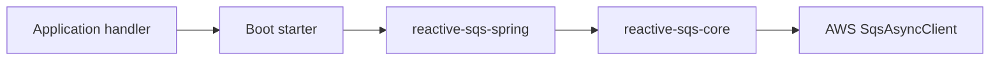

# Architecture

Reactive SQS owns an SQS message from the time SQS returns it until processing finishes or the
message is left for redelivery. Delivery is at least once.



## Modules

| Module                | Responsibility                                                        |
| --------------------- | --------------------------------------------------------------------- |
| `reactive-sqs-core`   | Polling, capacity, visibility, retries, delete batching, and shutdown |
| `reactive-sqs-spring` | Listener annotations, argument mapping, and Spring lifecycle          |
| Boot 3 starter        | Boot 3 setup, Jackson 2 mapping, optional Micrometer adapter          |
| Boot 4 starter        | Boot 4 setup, Jackson 3 mapping, optional Micrometer adapter          |

The application owns the `SqsAsyncClient`, including its credentials, timeouts, retries, and close
operation. The library does not close it.

## Capacity

`maxInFlight` limits all messages the listener currently owns:

```text
receive reservations + unsettled messages <= maxInFlight
```

A receive reservation is capacity held before `ReceiveMessage` starts. An unsettled message is a
message that was returned but has not finished processing and deletion.

The listener reserves capacity before polling. If SQS returns fewer messages than requested, it
releases unused capacity. A slot becomes free only after the message has reached a final local
state.

## Processing and delete

```text
received -> processing -> delete batch -> released
                  |
                  +-> released without delete
```

- JSON conversion and the handler run inside the processing timeout.
- A completed `Mono<Void>` queues one delete entry.
- Mapping errors, handler errors, timeouts, and cancellation do not delete the message.
- A delete error does not count as an acknowledgement. SQS may send the message again.
- The delete batch holds at most ten receipt handles and waits up to five milliseconds for other
  completed messages from the same listener.

The library does not run a handler again after an uncertain delete result.

## Visibility

SQS visibility starts when SQS returns the message. The listener renews visibility while a message
is processing or waiting for deletion.

Visibility renewal stops when local work ends. If the processing deadline, shutdown grace period,
or SQS 12-hour visibility budget ends first, the listener cancels unfinished work and does not
delete the message.

Visibility is not a lock. Applications must handle duplicates.

## Retry and shutdown

Receive failures are classified as retryable or terminal. Retryable receive failures use capped
exponential backoff with jitter. A terminal receive failure stops new polling but does not cancel
messages that are already running.

During Spring shutdown the listener:

1. Stops polling.
2. Lets active handlers and delete calls finish during `shutdownGraceSeconds`.
3. Cancels remaining work after the grace period.
4. Completes Spring shutdown after its local work is drained.

## Metrics

The core emits small, typed telemetry events. The Boot starters turn them into Micrometer meters
when the application supplies a `MeterRegistry`.

Metric callbacks are best effort. A metric failure cannot change message processing, capacity,
retries, deletes, or shutdown.

## Queue support

Version `0.1` supports standard queues only. FIFO queues are rejected at startup because FIFO needs
per-message-group ordering and settlement rules that are not implemented yet.

Standard queues can include `MessageGroupId` for fair queues. It is kept as message metadata but
does not make the listener process messages in order.
